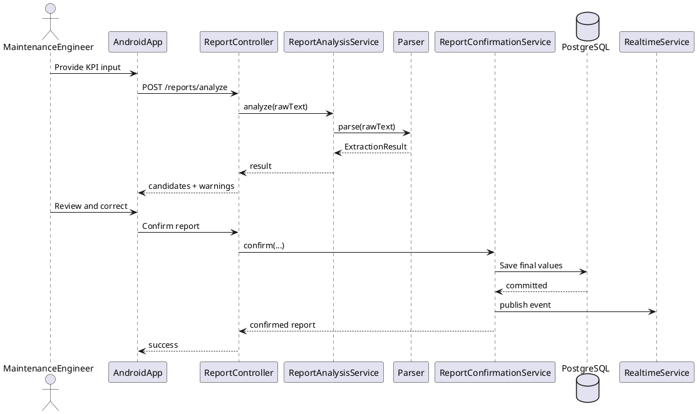
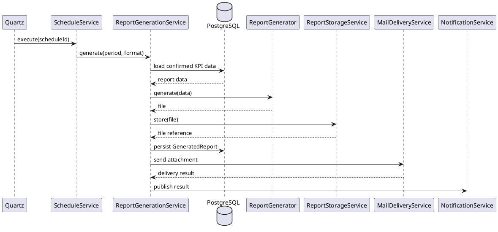

# 13_UML.md

> **FactoryFlow — UML & System Modeling Guide**
>
> Version: 1.0  
> Status: Active  
> Last updated: 2026-08-11
>
> This document defines the UML diagrams required for FactoryFlow, their intended content, notation rules, and report/portfolio usage.
>
> The objective is to model the system clearly without producing unreadable diagrams containing every framework class.

---

# 1. UML Objectives

FactoryFlow UML should explain:

```text
business structure
system responsibilities
core interactions
data acquisition flow
report automation
```

UML is communication, not decoration.

---

# 2. Required/Recommended Diagrams

High priority:

```text
1. Business Class Diagram
2. System Architecture Diagram
3. Unified Acquisition Pipeline
4. Confirmation Sequence Diagram
5. Scheduled Report Sequence Diagram
```

Optional:

```text
Use Case Diagram
Database ERD
Realtime Sequence Diagram
RabbitMQ Sequence Diagram
```

---

# 3. Business Class Diagram Goal

The report class diagram should contain approximately:

```text
10–15 meaningful domain concepts
```

not 40 framework classes.

---

# 4. Recommended Business Classes

Potential final set:

```text
MaintenanceEngineer
MaintenanceReport
KPIEntry
KPIDefinition
KPIAlias
ExtractionResult
ExtractionCandidate
GeneratedReport
ReportSchedule
ScheduleRun
Notification
AuditLog
ParserConfiguration
ReportPeriod
```

Use only concepts present in final implementation/model.

---

# 5. Recommended Enums

```text
ReportStatus
AcquisitionMethod
ReportFormat
GeneratedReportStatus
ReportType
ScheduleType
NotificationType
ConfidenceLevel
```

---

# 6. Core Relationships

Conceptually:

```text
MaintenanceEngineer 1 ───── 0..* MaintenanceReport

MaintenanceReport 1 ◆──── 0..* KPIEntry

KPIEntry * ───── 1 KPIDefinition

KPIDefinition 1 ◆──── 0..* KPIAlias

GeneratedReport * ───── 0..* MaintenanceReport

MaintenanceEngineer 1 ───── 0..* GeneratedReport

ReportSchedule 1 ───── 0..* ScheduleRun

ScheduleRun 0..1 ───── 0..* GeneratedReport

MaintenanceEngineer 1 ───── 0..* Notification

MaintenanceEngineer 0..1 ───── 0..* AuditLog
```

---

# 7. Composition Rule

Use composition (`◆`) only when child lifecycle is strongly owned.

Good candidate:

```text
MaintenanceReport ◆── KPIEntry
```

Potential:

```text
KPIDefinition ◆── KPIAlias
```

Do not use composition merely to make diagram look sophisticated.

---

# 8. Aggregation Rule

Shared aggregation (`◇`) is often unnecessary.

Use simple association unless aggregation semantics are truly important.

---

# 9. Cardinality Rule

Every important association should include cardinality.

Examples:

```text
1
0..1
0..*
1..*
```

---

# 10. Inheritance Rule

Do not invent inheritance.

FactoryFlow likely needs little domain inheritance.

Prefer composition.

---

# 11. Class Attributes

Include only high-value attributes.

Example:

```text
KPIDefinition
-------------
id
code
displayName
unit
plausibleMin
plausibleMax
active
```

Do not list every timestamp if diagram becomes crowded.

---

# 12. Class Methods

For business/report UML, methods may be omitted or limited.

If included:

```text
confirm()
addEntry()
deactivate()
```

Do not list getters/setters.

---

# 13. MaintenanceEngineer

Represents authenticated application user.

Attributes:

```text
id
name
email
active
```

Do not add role hierarchy in current model.

---

# 14. MaintenanceReport

Core aggregate.

Suggested attributes:

```text
id
source
status
rawText
submittedAt
confirmedAt
```

Relationships:

```text
submitted by MaintenanceEngineer
contains KPIEntry
```

---

# 15. KPIEntry

Suggested:

```text
id
extractedValue
finalValue
confidenceScore
editedByUser
capturedUnit
```

Must show link to:

```text
KPIDefinition
```

This class visually communicates human-in-the-loop traceability.

---

# 16. KPIDefinition

Suggested:

```text
id
code
displayName
category
unit
plausibleMin
plausibleMax
active
```

---

# 17. KPIAlias

Suggested:

```text
id
alias
normalizedAlias
```

Belongs to one definition.

---

# 18. ExtractionResult

Represents parser output before confirmation.

Suggested:

```text
recognizedCount
needsReviewCount
unrecognizedCount
```

May contain:

```text
ExtractionCandidate
```

---

# 19. ExtractionCandidate

Suggested:

```text
sourceLabel
sourceLine
extractedValue
confidence
warnings
```

Association to KPIDefinition may be:

```text
0..1
```

if unknown candidates can exist.

---

# 20. GeneratedReport

Suggested:

```text
id
type
format
periodStart
periodEnd
status
generatedAt
filePath
origin
```

---

# 21. ReportSchedule

Suggested:

```text
id
scheduleType
time
timezone
enabled
```

---

# 22. ScheduleRun

Suggested:

```text
scheduledFor
startedAt
finishedAt
status
```

---

# 23. Notification

Suggested:

```text
id
type
title
readAt
createdAt
```

---

# 24. AuditLog

Suggested:

```text
action
entityType
entityId
occurredAt
```

---

# 25. ParserConfiguration

Include only if parser configuration is a real modeled concept.

Suggested:

```text
fuzzyThreshold
```

Do not include if it remains plain application config.

---

# 26. Class Diagram Report Version

Keep report class diagram readable.

Target:

```text
10–15 classes
```

---

# 27. Class Diagram Implementation Version

A detailed implementation diagram may contain:

- services
- repositories
- controllers
- DTOs
- Android ViewModels

but should live in documentation, not necessarily academic report.

---

# 28. System Architecture Diagram

Required blocks:

```text
Maintenance Engineer
Android App
Spring Boot Backend
PostgreSQL
Report Storage
SMTP
FCM
```

Optional:

```text
RabbitMQ
Prometheus/Grafana
```

only if implemented.

---

# 29. Architecture Arrows

Show protocols:

```text
REST
WebSocket/STOMP
FCM
SMTP
JDBC/JPA
File I/O
```

Do not use unlabeled arrows when communication type matters.

---

# 30. Architecture Diagram Example

```text
┌────────────────────┐
│ Maintenance        │
│ Engineer           │
└─────────┬──────────┘
          │
          ▼
┌────────────────────┐
│ Android App        │
│ Compose / OCR API  │
│ Gallery / Share    │
└──────┬──────┬──────┘
       │REST  │STOMP
       ▼      ▼
┌────────────────────┐
│ Spring Boot        │
│ Auth / Parser      │
│ Reports / Quartz   │
└──────┬──────┬──────┘
       │      │
       ▼      ▼
 PostgreSQL  Report Storage
       │
       ├── SMTP
       └── FCM
```

---

# 31. Unified Acquisition Pipeline

This is one of the most important diagrams.

```text
Manual Entry ───────────────┐
Paste Text ────────────────┤
Gallery → OCR ─────────────┤
Share → OCR ───────────────┤
            ↓
     Deterministic Parser
            ↓
      Extraction Result
            ↓
      Human Validation
            ↓
      Confirmed Data
            ↓
         PostgreSQL
```

---

# 32. Acquisition Pipeline Meaning

The diagram must communicate:

```text
different inputs
→ one validation model
```

That is more important than showing libraries.

---

# 33. Confirmation Sequence Diagram

Recommended participants:

```text
MaintenanceEngineer
AndroidApp
ReportController
ReportAnalysisService
Parser
ReportConfirmationService
PostgreSQL
RealtimeService
```

---

# 34. Confirmation Sequence

Conceptually:

```text
Engineer → Android: Paste/share input
Android → Backend: analyze(rawText)
Backend → Parser: parse
Parser → Backend: extraction result
Backend → Android: candidates + warnings
Engineer → Android: correct values
Android → Backend: confirm(final values)
Backend → PostgreSQL: persist confirmed report
Backend → Realtime: publish report confirmed
Backend → Android: confirmed report
```

---

# 35. Confirmation Sequence PlantUML Skeleton



Adapt final names/routes to implementation.

---

# 36. Scheduled Report Sequence Diagram

Participants:

```text
Quartz
ScheduleService
ReportGenerationService
PostgreSQL
Excel/PdfGenerator
ReportStorageService
MailDeliveryService
NotificationService
```

---

# 37. Scheduled Sequence

```text
Quartz
→ ScheduleService
→ calculate period
→ load confirmed data
→ generator
→ storage
→ persist metadata
→ email
→ notification
```

---

# 38. Scheduled Report PlantUML Skeleton



---

# 39. OCR Sequence Diagram

Optional.

Participants:

```text
MaintenanceEngineer
AndroidApp
MLKit
BackendParser
ConfirmationUI
```

Useful if mobile integration is a report focus.

---

# 40. Share Intent Sequence

Optional but strong for portfolio.

```text
WhatsApp
→ Android OS
→ FactoryFlow
→ PaddleOCR API
→ Backend
→ Confirmation
```

---

# 41. Realtime Sequence Diagram

Optional.

```text
Backend
→ STOMP
→ Android
→ REST refresh
→ UI update
```

This demonstrates that WebSocket is invalidation, not source of truth.

---

# 42. FCM Sequence Diagram

Optional.

```text
Backend event
→ FCM
→ Android notification
→ tap
→ REST detail
```

---

# 43. RabbitMQ Diagram

Only if implemented.

Do not include planned RabbitMQ as actual architecture.

---

# 44. Use Case Diagram

Potential actor:

```text
Maintenance Engineer
```

Use cases:

```text
Authenticate
Create Maintenance Report
Paste KPI Text
Import KPI Image
Capture KPI Image
Enter KPI Manually
Review Extraction
Save Draft
Confirm Report
View Dashboard
Search Reports
Generate Excel
Generate PDF
Manage Schedule
View Notifications
View Statistics
```

---

# 45. Use Case Include/Extend

Use `include` only when semantically correct.

Example:

```text
Import Image
includes
OCR
```

But do not overcomplicate.

---

# 46. ERD

Recommended core:

```text
users
maintenance_reports
kpi_entries
kpi_definitions
kpi_aliases
generated_reports
report_schedules
```

Show PK/FK.

---

# 47. ERD vs UML

ERD explains physical persistence.

Class diagram explains business/domain model.

Do not treat them as the same diagram.

---

# 48. Diagram Style

Use clean:

- white/light neutral background
- minimal colors
- FactoryFlow accent sparingly
- readable typography
- consistent arrow styles

Follow `DESIGN.md` quality bar.

---

# 49. Diagram Density

Avoid unreadable A3-style diagrams squeezed into report page.

Split if necessary.

---

# 50. Diagram Source

Prefer source-controlled diagram definitions.

Examples:

```text
PlantUML
Mermaid
draw.io source
```

Store under:

```text
diagrams/
```

---

# 51. Diagram Export

Export high resolution:

```text
SVG
PDF
PNG
```

depending report tooling.

Avoid blurry screenshots.

---

# 52. Diagram Naming

Recommended:

```text
architecture.puml
class_diagram.puml
sequence_confirmation.puml
sequence_scheduled_report.puml
acquisition_pipeline.puml
```

---

# 53. Report Diagram Priority

If limited space:

```text
1. Acquisition pipeline
2. Architecture
3. Confirmation sequence
4. Business class diagram
```

---

# 54. Portfolio Diagram Priority

GitHub may include all major diagrams.

---

# 55. Diagram Accuracy

Never show a component as implemented if it is not.

Optional future components should be labeled:

```text
Future
Optional
```

or omitted.

---

# 56. UML Update Rule

When implementation changes significantly:

Update UML.

Do not let diagrams become fictional.

---

# 57. Class Diagram Checklist

```text
[ ] 10–15 meaningful concepts
[ ] correct cardinalities
[ ] no fake inheritance
[ ] composition used correctly
[ ] no framework noise
[ ] names match project terminology
[ ] final values/extraction concepts visible
```

---

# 58. Sequence Diagram Checklist

```text
[ ] actor clear
[ ] boundaries clear
[ ] human validation visible
[ ] backend authority visible
[ ] DB persistence visible
[ ] external side effects ordered correctly
```

---

# 59. Architecture Diagram Checklist

```text
[ ] Android
[ ] Backend
[ ] PostgreSQL
[ ] storage
[ ] REST
[ ] realtime if implemented
[ ] SMTP/FCM if implemented
[ ] optional components not misrepresented
```

---

# 60. Final UML Principle

FactoryFlow diagrams should help a reviewer understand:

```text
what the system is
how data moves
where trust is established
how reporting is automated
```

If a diagram only proves that many classes exist, it is not useful.

---

# End of 13_UML.md
